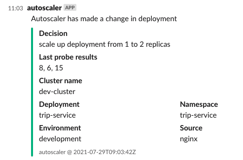

<a href="https://airhelp.com">
    
</a>

# Autoscaler

- [Autoscaler](#autoscaler)
  - [Description](#description)
  - [Features](#features)
  - [Configuration and running application](#configuration-and-running-application)
    - [TLDR](#tldr)
    - [Running outside k8s cluster](#running-outside-k8s-cluster)
    - [Env variables](#env-variables)
    - [CLI arguments](#cli-arguments)
    - [Configuration](#configuration)
    - [Caveats](#caveats)
      - [Consecutive zeros before zeroing deployment](#consecutive-zeros-before-zeroing-deployment)
      - [Setting up nginx based probe](#setting-up-nginx-based-probe)
      - [Complexity of nginx probe](#complexity-of-nginx-probe)
      - [Default nginx probe configuration](#default-nginx-probe-configuration)
    - [K8S requirements](#k8s-requirements)
  - [Development](#development)

## Description

Autoscaler is a tool for automatic management of deployment size in Kubernetes clusters written by [AirHelp](https://airhelp.com). It should be used to horizontally scale deployments based on their workload fetched using different probes, eg. size of queues or number of connections served in given time.



## Features

Autoscaler currently supports probes based on:

* [AWS SQS](https://aws.amazon.com/sqs/)
* [Redis](https://redis.io/)
* [Nginx](https://nginx.org/) (for web traffic serving deployments)

Generic features:

* Ability to manage all deployments in a given namespace from a single pod
* Config override for given hours
* Slack integration

## Configuration and running application

### TLDR

See [examples](_examples)

### Running outside k8s cluster

Autoscaler can also be run from outside k8s cluster, it can use your kubeconfig. Please note that some features won't work like Nginx autoscaling.

### Env variables

By default Autoscaler requires no ENV variables.

Only exception is SQS - in such situation you need to provide usual set of AWS ENV variables like: `AWS_REGION`, `AWS_ACCESS_KEY_ID`, `AWS_SECRET_ACCESS_KEY`. These are required to configure AWS SQS client which will query for queue sizes. See [example](_examples/sqs_autoscalling/) for full configuration including AWS IAM policies.

### CLI arguments

Autoscaler requires some CLI arguments to start application properly:

| CLI Argument    | short | required | type   | default | description                                                                                  |
| --------------- | ----- | -------- | ------ | ------- | -------------------------------------------------------------------------------------------- |
| --version       |       | false    | n/a    | false   | Prints autoscaler version                                                                    |
| --environment   |       | true     | string | n/a     | Environment in which autoscaler is run, basically same as application that it is controlling |
| --namespace     |       | true     | string | n/a     | Name of K8S namespace                                                                        |
| --slack_url     |       | false    | string | n/a     | Slack Webhook URL to which post messages about changes in deployments                        |
| --slack_channel |       | false    | string | n/a     | Slack channel to which post messages about changes in deployments                            |
| --verbose       | -v    | false    | n/a    | false   | Whether to show debug rich information during application lifecyle                           |

### Configuration

Autoscaler requires dedicated ConfigMap to be deployed within same namespace, name of ConfigMap should be `autoscaler-config`. Syntax of config:

```yaml
deployment_name_1: |
  <INNER_CONFIG_IN_YAML>
deployment_name_2: |
  <INNER_CONFIG_IN_YAML>
```

Parameters for inner config:

| Parameter                              | Required                            | Type                  | Default                   | description                                                                                                                                                                                                                                                                                                                                                                                                                                                                                                                                  |
| -------------------------------------- | ----------------------------------- | --------------------- | ------------------------- | -------------------------------------------------------------------------------------------------------------------------------------------------------------------------------------------------------------------------------------------------------------------------------------------------------------------------------------------------------------------------------------------------------------------------------------------------------------------------------------------------------------------------------------------- |
| minimum_number_of_pods                 | false                               | int                   | 0                         | minimum number of pods that deployment can be at                                                                                                                                                                                                                                                                                                                                                                                                                                                                                             |
| maximum_number_of_pods                 | false                               | int                   | 3                         | maximum number of pods that deployment can be at                                                                                                                                                                                                                                                                                                                                                                                                                                                                                             |
| check_interval                         | false                               | string(Time.Duration) | 1m                        | how often to perform checks on probe                                                                                                                                                                                                                                                                                                                                                                                                                                                                                                         |
| cooldown_period                        | false                               | string(Time.Duration) | 5m                        | how long to wait before making another action. Cooldown period is applied in all situations after making a decision with one exception: when autoscaler decides to shrink down deployment to 0 it will ignore cooldown period to quickly respond to new workload arrival                                                                                                                                                                                                                                                                     |
| threshold                              | true                                | int                   | n/a                       | how much work one instance of deployment can perform in `check_interval` period<br><br>**for workers**: number of jobs that one instance can perform in given time<br>**for webs**: how many simultanous connections can one web pod serve                                                                                                                                                                                                                                                                                                   |
| hourly_config                          | false                               | Array\<Hash\>         | n/a                       | list of configs to be applied in given hours. Example usage: you want to have 1 worker always ready during business hours, at night we can scale down to 0. <br><br> Hourly configs overwrite root level max/min number of pods in given hours. You can specify multiple periods, first one to match current time will be applied. Note: entering another period won't trigger autoscale on it's own - if you have configuration from example it will wait for normal scale up to 1 but won't scale it down to 0 until after business hours. |
| hourly_config.[]name                   | true                                | string                | n/a                       | name of hourly config configuration, used for debugging purposes                                                                                                                                                                                                                                                                                                                                                                                                                                                                             |
| hourly_config.[]start_hour             | true                                | int                   | n/a                       | starting hour for given config. Hours are checked in UTC timezone                                                                                                                                                                                                                                                                                                                                                                                                                                                                            |
| hourly_config.[]end_hour               | true                                | int                   | n/a                       | end hour of given config. Hours are checked in UTC timezone                                                                                                                                                                                                                                                                                                                                                                                                                                                                                  |
| hourly_config.[]minimum_number_of_pods | true                                | int                   | n/a                       | minimum number of pods appliable in given period                                                                                                                                                                                                                                                                                                                                                                                                                                                                                             |
| hourly_config.[]maximum_number_of_pods | true                                | int                   | n/a                       | maximum number of pods appliable in given period                                                                                                                                                                                                                                                                                                                                                                                                                                                                                             |
| sqs                                    | true (one probe config is required) | hash                  | n/a                       | config for SQS probe                                                                                                                                                                                                                                                                                                                                                                                                                                                                                                                         |
| sqs.queues                             | true                                | Array\<string\>       | n/a                       | list of queue names to check                                                                                                                                                                                                                                                                                                                                                                                                                                                                                                                 |
| redis                                  | true (one probe config is required) | hash                  | n/a                       | config for Redis probe                                                                                                                                                                                                                                                                                                                                                                                                                                                                                                                       |
| redis.hosts                            | true                                | Array\<string\>       | n/a                       | list of hosts Redis (needs to include port)                                                                                                                                                                                                                                                                                                                                                                                                                                                                                                  |
| redis.list_keys                        | true                                | Array\<string\>       | n/a                       | collection of list type keys to check length for                                                                                                                                                                                                                                                                                                                                                                                                                                                                                             |
| nginx                                  | true (one probe config is required) | hash                  | n/a                       | config for Nginx probe (for Web deployments)                                                                                                                                                                                                                                                                                                                                                                                                                                                                                                 |
| nginx.endpoint                         | false                               | string                | /stats/active_connections | endpoint which serves active connections statistics in pod                                                                                                                                                                                                                                                                                                                                                                                                                                                                                   |
| nginx.statistic                        | false                               | string                | maximum                   | statistic use to calculate value for connections occupied. Appliable statistics: `median`, `average` and `maximum`                                                                                                                                                                                                                                                                                                                                                                                                                           |
| nginx.consecutive_reads                | false                               | int                   | 3                         | how many times per run to check nginx stats to gather connections info                                                                                                                                                                                                                                                                                                                                                                                                                                                                       |
| nginx.timeout                          | false                               | string(Time.Duration) | 1s                        | how long to wait between each consecutive read                                                                                                                                                                                                                                                                                                                                                                                                                                                                                               |

Example config as K8S ConfigMap payload:

```yaml
apiVersion: v1
kind: ConfigMap
metadata:
  name: autoscaler-config
  namespace: autoscaler-test
data:
  sqs-deployment: |
    minimum_number_of_pods: 0
    maximum_number_of_pods: 3
    check_interval: 1m
    cooldown_period: 5m
    threshold: 20
    sqs:
      queues:
        - autoscaler-test-queue
        - autoscaler-test-queue-2
    hourly_config:
      - name: business-hours
        start_hour: 8
        end_hour: 16
        minimum_number_of_pods: 1
        maximum_number_of_pods: 3
  redis-deployment: |
    minimum_number_of_pods: 0
    maximum_number_of_pods: 5
    check_interval: 15s
    cooldown_period: 60s
    threshold: 100
    redis:
      hosts:
        - redis1:6379
        - redis2:6379
      list_keys:
        - autoscaler_test_1
        - autoscaler_test_2
  web-deployment: |
    minimum_number_of_pods: 1
    maximum_number_of_pods: 5
    check_interval: 30s
    cooldown_period: 45s
    threshold: 15
    nginx:
      statistic: average
      consecutive_reads: 5
      timeout: 1s
  other-deployment: |
    minimum_number_of_pods: 1
    maximum_number_of_pods: 99
    check_interval: 5s
    cooldown_period: 900s
    threshold: 50
    sqs:
      queues:
        - other-queue
```

### Caveats

#### Consecutive zeros before zeroing deployment

Autoscaler has a built in feature, that it'll require **5 consecutive zeros** in probe results history before deciding to put deployment on zero replicas spec. This feature is not configurable, it is built in to prevent premature deployment zeroing, especially in situations when load is small and worker is doing fine with cleaning up queues.

#### Setting up nginx based probe

To autoscale web deployments you need to provide endpoint which will return simple number of currently used active connections. This can be returned by application or by web server (eg. Nginx).

Sample configuration using [ngx_http_stub_status_module](https://nginx.org/libxslt/en/docs/http/ngx_http_stub_status_module.html) in Nginx:

```
location /stats/active_connections {
    add_header Content-Type text/plain;
    return 200 $connections_active;
}
```

You can use default `/stats/active_connections` or specify your custom endpoint using `endpoint` parameter in prove configuration.

#### Complexity of nginx probe

Autoscaling webs is quite complex. It uses [ngx_http_stub_status_module](https://nginx.org/libxslt/en/docs/http/ngx_http_stub_status_module.html) to provide information about Nginx process stastistics we care about active connections only.

To minimize "overreaction" atuoscaler gathers information for couple seconds - it runs stat gathering `nginx.consecutive_reads` times with `nginx.timeout` break in between for each pod. So if it has 5 pods, 3 consecutive reads and 1 second timeout it runs it 15 times over 3 seconds in total. After gathering information it applies statistic (median, average or maximum) to normalize output and based on that Autoscaler decides what to do.

#### Default nginx probe configuration

Nginx probe for web deployments scalling does not require any parameter but for it to be parsed properly we need to ensure that it's value is treated as nested object, simply add `{}` there:

```yaml
  web-deployment: |
    minimum_number_of_pods: 1
    maximum_number_of_pods: 5
    check_interval: 30s
    cooldown_period: 45s
    threshold: 15
    nginx: {}
```

### K8S requirements

As autoscaler needs to read and modify some resources in K8S cluster/namespace it is required to provide some RBAC entries and service account. Minimal set of requirements:

```yaml
---
apiVersion: v1
kind: ServiceAccount
metadata:
  name: autoscaler
  namespace: <NAMESPACE>

---
kind: Role
apiVersion: rbac.authorization.k8s.io/v1
metadata:
  name: autoscaler-role
  namespace: <NAMESPACE>
rules:
  - apiGroups: ["apps"]
    resources: ["deployments"]
    verbs: ["get", "list", "describe", "update"]
  - apiGroups: [""]
    resources: ["configmaps"]
    resourceNames: ["autoscaler-config"]
    verbs: ["get", "describe"]
  - apiGroups: [""]
    resources: ["pods"]
    verbs: ["list"]

---
apiVersion: rbac.authorization.k8s.io/v1
kind: RoleBinding
metadata:
  name: autoscaler-role-binding
  namespace: <NAMESPACE>
roleRef:
  apiGroup: rbac.authorization.k8s.io
  kind: Role
  name: autoscaler-role
subjects:
  - kind: ServiceAccount
    name: autoscaler
    namespace: <NAMESPACE>
```

## Development

See [DEVELOPMENT.md](./DEVELOPMENT.md)
